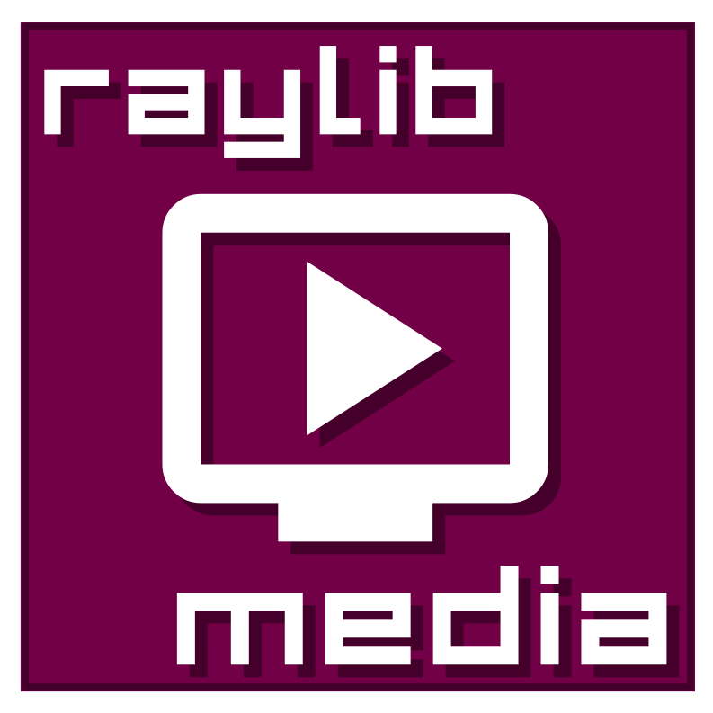
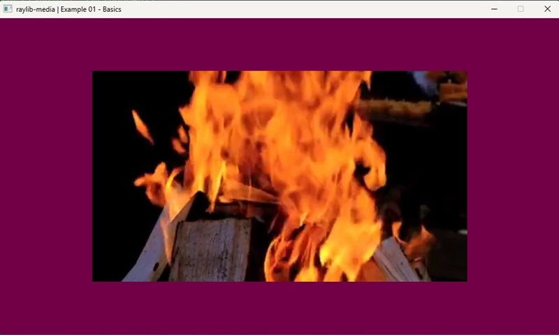
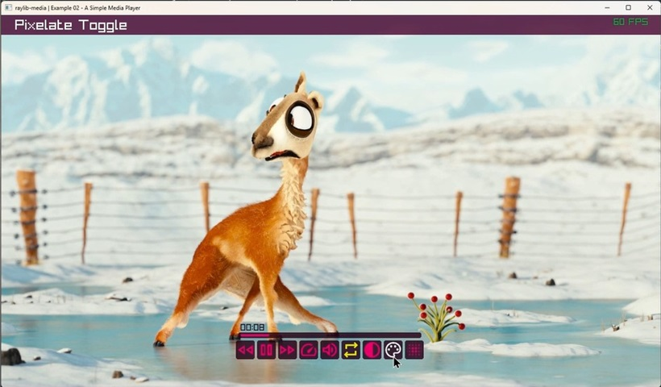
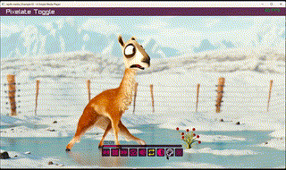
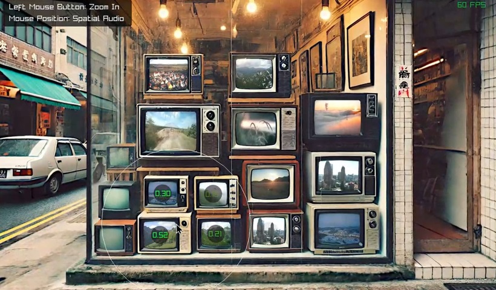
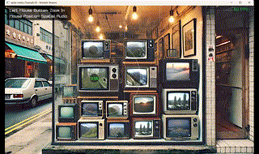

  

> **Note**: This library is in **beta**. Your feedback and support in enhancing its quality are greatly appreciated!

## Introduction

**raylib-media** is a clean and user-friendly *extension* for [raylib](https://www.raylib.com/) that adds seamless audio and video streaming support via the [FFmpeg](https://ffmpeg.org/about.html) **libav\*** libraries.
It enables easy integration of multimedia content into raylib applications, providing direct access to video textures and audio streams, with support for seeking and looping.

<p align="center">
  
  
</p>

## Table of Contents

- [Core Features](#core-features)
- [Minimal Usage](#minimal-usage)
- [Code Examples](#code-examples)
- [Dependencies](#dependencies)
- [About FFmpeg](#about-ffmpeg)
- [License](#license)
- [Credits](#credits)

## Core Features

- Portable code: successfully tested on **Windows**, **Linux**, **MacOS**.
- Simple yet effective, with customizable options
- Direct access to video `Texture` and `AudioStream` for efficient media handling
- Optimized memory usage: no direct allocations are made outside the `LoadMedia` function.
- Synchronized audio and video playback
- Supports media seeking and looping
- Supports loading media from custom streams, enabling flexible input sources like archives, online streams, or encrypted resource packs
- Compatible with formats supported by the codecs in the linked FFmpeg build

## Minimal Usage

These 3-4 lines of code show the minimal code needed to play a video with `raylib-media`:

```c
#include <raymedia.h>

MediaStream media = LoadMedia("path/to/your_file.mp4"); // Load the media

while (...) { // Begin your main loop
    ...
    UpdateMedia(&media); // Update the media stream according to frame time
    ...
    DrawTexture(media.videoTexture, 0, 0, WHITE); // Draw the video frame
    ...
}

UnloadMedia(&media); // Unload media when done
```
---

## Code Examples

**[`1) example_01_basics.c`](https://github.com/cloudofoz/raylib-media/blob/main/examples/media/example_01_basics.c)**  
> *Description:* Demonstrates how to play a video on the screen and loop it continuously.
   <p align="center">
    
   </p>
   
**[`2) example_02_media_player.c`](https://github.com/cloudofoz/raylib-media/blob/main/examples/media/example_02_media_player.c)**  
> *Description:* A simple media player illustrating how to control playback speed, seek, pause, loop, adjust audio volume, and apply real-time shader effects to the video.
   <p align="center">
    
    
   </p>

**[`3) example_03_multi_stream.c`](https://github.com/cloudofoz/raylib-media/blob/main/examples/media/example_03_multi_stream.c)**
> *Description:* A 3D demo scene demonstrating multiple video streams with synchronized audio that dynamically adjusts based on cursor proximity.
   <p align="center">
    
    
   </p>

**[`4) example_04_custom_stream.c`](https://github.com/cloudofoz/raylib-media/blob/main/examples/media/example_04_custom_stream.c)**  
> *Description:* Demonstrates how to use `LoadMediaFromStream` with custom callbacks for reading media.  
> This example simulates a custom stream using a memory buffer, showcasing the flexibility of the API. Real-world use cases include:
> - Reading from compressed archives  
> - Streaming over a network  
> - Accessing custom data formats or encrypted resources  

---

## Dependencies

`raylib-media` depends on the following files and libraries (*a build system is not yet available, contributions are welcomed!*):
> *E.g. with GCC*: `gcc ... rmedia.c -lraylib -lavcodec -lavformat -lavutil -lswresample -lswscale`


1. **`src/raymedia.h`** and **`src/rmedia.c`**

   - You can include them directly in your project or compile **`rmedia.c`** and use the compiled library.

2. **[raylib](https://www.raylib.com/)**

   - Since **raylib-media** is an extension of **raylib**, it's assumed you are already using it and know how to compile it. This can easily be done using CMake or one of the available project files.

3. The following subset of **libav\*** libraries from **[FFmpeg](https://www.ffmpeg.org/)**:

   - **`libavcodec`**
   - **`libavformat`**
   - **`libavutil`**
   - **`libswresample`**
   - **`libswscale`**

   You may want to start by using precompiled libraries and later compile your own version, if needed:

   - **Linux**: Install via your package manager (e.g., `sudo apt install libavcodec-dev libavformat-dev libavutil-dev libswresample-dev libswscale-dev`).
     
   - **macOS**:
     Use Homebrew (`brew install ffmpeg`).
     
   - **Windows**:
     Download compiled libraries from sources like [FFmpeg Builds by BtbN](https://github.com/BtbN/FFmpeg-Builds): [`ffmpeg-n7.1-latest-win64-lgpl-shared-7.1.zip`](https://github.com/BtbN/FFmpeg-Builds/releases/download/latest/ffmpeg-n7.1-latest-win64-lgpl-shared-7.1.zip)


---

## About FFmpeg

FFmpeg is available in two versions:

- The complete version under a **GPL** license.
- A more permissive version without certain proprietary codecs under an **LGPL** license.

**What does this mean for you?**

- **LGPL Version**: If you prefer more flexibility in licensing your own code, choose the LGPL version. By linking LGPL **libav\*** libraries dynamically, you're free to license your code as you wish without additional obligations.
- **GPL Version**: Using the GPL version requires that your code also be released under the GPL license, which mandates that the source code be made available under the same terms.


---

## License

This project is licensed under the **Zlib** License - see the [LICENSE](LICENSE.md) file for details.

---
  
## Credits

Special thanks to the following resources:

- [FFmpeg Libav Tutorial](https://github.com/leandromoreira/ffmpeg-libav-tutorial) - This resource was invaluable in helping me start to dive into FFmpeg and Libav.
- [FFmpeg Builds by BtbN](https://github.com/BtbN/FFmpeg-Builds) - For providing compiled dependencies that are easy and straightforward to use, perfect for immediately starting to use **raylib-media** in a "portable" way.
- [Blender Open Movie projects](https://studio.blender.org/films/) - These movies are not just very cool, but they have been a precious resource for testing my code.
